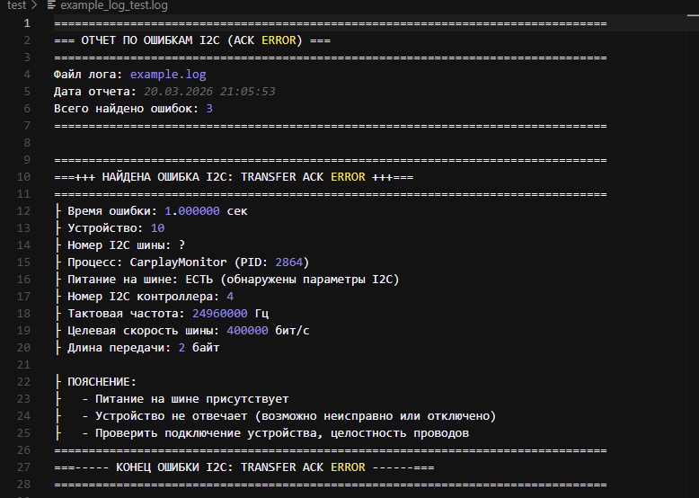

# Changan (Uni S) errors search script

> Проблема: есть большой лог Kernel машины Changan Uni S. Нужно понять, какое устройство не работает по `transfer ACK error`

> Решение: скрипт парсит каждую строку и выводит человекопонятные сообщения об ошибках

## Скрипт просто ищет ошибки связанные с `transfer ACK error` и выводит их в отдельный файл 

## Установка *&* Использование

<div>

1. __Скачайте Python 3.0+__

```bash
# Windows (PowerShell)
winget install Python.Python.3.10

# macOS
brew install python

# Linux (Ubuntu/Debian)
sudo apt update && sudo apt install python3 -y
```

2. __Скачайте этот репозиторий__
```bash
# Если есть Git
git clone https://github.com/bulatik205/changan-uni-s-errors-search.git
```
*Если Git нету, просто скачайте [архив](https://github.com/bulatik205/changan-uni-s-errors-search/archive/refs/heads/main.zip)*

3. __Поместите ваш лог файл типа `kernel_log_*.curf` в одну папку с `changan-uni-s-errors-search`__

4. __Откройте консоль и перейдите в `changan-uni-s-errors-search`__
```bash
cd C:\PATH_TO_changan-uni-s-errors-search\
```

5. __Выполните команду в консоли__
```bash
py main.py
```

6. __Введите название файла с логами__
```bash
>>> Название файла лога: kernel_log_*.curf
```

7. __Откройте получившийся лог в той же директории в виде `НАЗВАНИЕ-ФАЙЛА_export_ДАТА_ВРЕМЯ.log`__

</div>

## 🏹 Разбор `НАЗВАНИЕ-ФАЙЛА_export_ДАТА_ВРЕМЯ.log`

<div>

 

### Начало

1. __Объявления: `ОТЧЕТ ПО ОШИБКАМ I2C (ACK ERROR)`__

2. __Пишется название читаемого файла: `Файл лога: example.log`__

3. __Дата отчета: `Дата отчета: 20.03.2026 21:05:53`__

4. __Общее количество найденных ошибок: `Всего найдено ошибок: 3`__

</div>

<div>

### Сам формат лога

1. __Время ошибки:__ в `секунды.миллисекунды` со старта ядра `Kernel`

2. __Устройство:__ это `addr` физический адрес устройства, которое подключенно к шине `I2C`. `10`

2. __Номер I2C шины:__ *требует пересмотра*

2. __Процесс:__ это то, что вызвало ошибку. `CarplayMonitor (PID: 2864)`

2. __Питание на шине:__ сказать точно нельзя, но по косвенным признакам можно определить. `ЕСТЬ (обнаружены параметры I2C)`

2. __Номер I2C контроллера:__ показывает номер шины. `4`

2. __Тактовая частота шины:__ (clk) в `Гц`. `24960000 Гц`

2. __Целевая скорость шины:__ (speed) в бит/с. `400000 бит/с`

2. __Длина передачи:__ (trans_len) в байт. `2`

2. __Пояснение:__ коротко рассказывает вероятные причины ошибки

</div>

## Пример работы

### Был лог:

```curf
<6>[   1.000000]  (3)[2864:CarplayMonitor]addr: 10, transfer ACK error
<6>[   1.000001]  (3)[2864:CarplayMonitor]i2c_dump_info ++++++++++++++++++++++++++++++++++++++++++
<3>[   1.000002]  (3)[2864:CarplayMonitor]I2C structure:
<3>[   1.000003] [I2C]Clk=24960000,Id=4,Op=2,Irq_stat=3,Total_len=2
<3>[   1.000004] [I2C]Trans_len=2,Trans_num=1,Trans_auxlen=0,speed=400000
<3>[   1.000005] [I2C]Trans_stop=1,cg_cnt=1,hs_only=1, ch_offset=256,ch_offset_default=256
<6>[   1.000006]  (3)[2864:CarplayMonitor]base address 0xffffff800dfee000
<6>[   1.000007]  (3)[2864:CarplayMonitor]I2C register:
<6>[   1.000008] [I2C]SLAVE_ADDR=21,INTR_MASK=0,INTR_STAT=0,CONTROL=28,TRANSFER_LEN=2
<6>[   1.000009] [I2C]TRANSAC_LEN=1,DELAY_LEN=2,TIMING=405,LTIMING=22,START=0,FIFO_STAT=1
<6>[   1.000010] [I2C]IO_CONFIG=3,HS=0,DCM_EN=0,DEBUGSTAT=300,EXT_CONF=1801,TRANSFER_LEN_AUX=2
<6>[   1.000011]  (3)[2864:CarplayMonitor]before enable DMA register(0x0):
<6>[   1.000012] [I2C]INT_FLAG=0,INT_EN=0,EN=0,RST=0,
<6>[   1.000013] [I2C]STOP=0,FLUSH=0,CON=0,TX_MEM_ADDR=0, RX_MEM_ADDR=0
<6>[   1.000014] [I2C]TX_LEN=0,RX_LEN=0,INT_BUF_SIZE=0,DEBUG_STATUS=0
<6>[   1.000015] [I2C]TX_MEM_ADDR2=0, RX_MEM_ADDR2=0
<6>[   1.000016]  (3)[2864:CarplayMonitor]DMA register(0xffffff800dff0100):
<6>[   1.000017] [I2C]INT_FLAG=0,INT_EN=0,EN=0,RST=0,
<6>[   1.000018] [I2C]STOP=0,FLUSH=0,CON=8,TX_MEM_ADDR=0, RX_MEM_ADDR=0
<6>[   1.000019] [I2C]TX_LEN=0,RX_LEN=0,INT_BUF_SIZE=0,DEBUG_STATUS=0
<6>[   1.000020] [I2C]TX_MEM_ADDR2=0, RX_MEM_ADDR2=0
<6>[   1.000021]  (3)[2864:CarplayMonitor]i2c_dump_info ------------------------------------------
<6>[   1.000022]  (3)[2864:CarplayMonitor]addr: 41, transfer ACK error
<6>[   1.000023]  (3)[2864:CarplayMonitor]i2c_dump_info ++++++++++++++++++++++++++++++++++++++++++
<3>[   1.000024]  (3)[2864:CarplayMonitor]I2C structure:
<3>[   1.000025] [I2C]Clk=24960000,Id=4,Op=2,Irq_stat=3,Total_len=2
<3>[   1.000026] [I2C]Trans_len=2,Trans_num=1,Trans_auxlen=0,speed=400000
<3>[   1.000027] [I2C]Trans_stop=1,cg_cnt=1,hs_only=1, ch_offset=256,ch_offset_default=256
<6>[   1.000028]  (3)[2864:CarplayMonitor]base address 0xffffff800dfee000
<6>[   1.000029]  (3)[2864:CarplayMonitor]I2C register:
<6>[   1.000030] [I2C]SLAVE_ADDR=21,INTR_MASK=0,INTR_STAT=0,CONTROL=28,TRANSFER_LEN=2
<6>[   1.000031] [I2C]TRANSAC_LEN=1,DELAY_LEN=2,TIMING=405,LTIMING=22,START=0,FIFO_STAT=1
<6>[   1.000032] [I2C]IO_CONFIG=3,HS=0,DCM_EN=0,DEBUGSTAT=300,EXT_CONF=1801,TRANSFER_LEN_AUX=2
<6>[   1.000033]  (3)[2864:CarplayMonitor]before enable DMA register(0x0):
<6>[   1.000034] [I2C]INT_FLAG=0,INT_EN=0,EN=0,RST=0,
<6>[   1.000035] [I2C]STOP=0,FLUSH=0,CON=0,TX_MEM_ADDR=0, RX_MEM_ADDR=0
<6>[   1.000036] [I2C]TX_LEN=0,RX_LEN=0,INT_BUF_SIZE=0,DEBUG_STATUS=0
<6>[   1.000037] [I2C]TX_MEM_ADDR2=0, RX_MEM_ADDR2=0
<6>[   1.000038]  (3)[2864:CarplayMonitor]DMA register(0xffffff800dff0100):
<6>[   1.000039] [I2C]INT_FLAG=0,INT_EN=0,EN=0,RST=0,
<6>[   1.000040] [I2C]STOP=0,FLUSH=0,CON=8,TX_MEM_ADDR=0, RX_MEM_ADDR=0
<6>[   1.000041] [I2C]TX_LEN=0,RX_LEN=0,INT_BUF_SIZE=0,DEBUG_STATUS=0
<6>[   1.000042] [I2C]TX_MEM_ADDR2=0, RX_MEM_ADDR2=0
<6>[   1.000043]  (3)[2864:CarplayMonitor]i2c_dump_info ------------------------------------------
<6>[   1.000044]  (3)[2864:CarplayMonitor]addr: 43, transfer ACK error
<6>[   1.000045]  (3)[2864:CarplayMonitor]i2c_dump_info ++++++++++++++++++++++++++++++++++++++++++
<3>[   1.000046]  (3)[2864:CarplayMonitor]I2C structure:
<3>[   1.000047] [I2C]Clk=24960000,Id=4,Op=2,Irq_stat=3,Total_len=2
<3>[   1.000048] [I2C]Trans_len=2,Trans_num=1,Trans_auxlen=0,speed=400000
<3>[   1.000049] [I2C]Trans_stop=1,cg_cnt=1,hs_only=1, ch_offset=256,ch_offset_default=256
<6>[   1.000050]  (3)[2864:CarplayMonitor]base address 0xffffff800dfee000
<6>[   1.000051]  (3)[2864:CarplayMonitor]I2C register:
<6>[   1.000052] [I2C]SLAVE_ADDR=21,INTR_MASK=0,INTR_STAT=0,CONTROL=28,TRANSFER_LEN=2
<6>[   1.000053] [I2C]TRANSAC_LEN=1,DELAY_LEN=2,TIMING=405,LTIMING=22,START=0,FIFO_STAT=1
<6>[   1.000054] [I2C]IO_CONFIG=3,HS=0,DCM_EN=0,DEBUGSTAT=300,EXT_CONF=1801,TRANSFER_LEN_AUX=2
<6>[   1.000055]  (3)[2864:CarplayMonitor]before enable DMA register(0x0):
<6>[   1.000056] [I2C]INT_FLAG=0,INT_EN=0,EN=0,RST=0,
<6>[   1.000057] [I2C]STOP=0,FLUSH=0,CON=0,TX_MEM_ADDR=0, RX_MEM_ADDR=0
<6>[   1.000058] [I2C]TX_LEN=0,RX_LEN=0,INT_BUF_SIZE=0,DEBUG_STATUS=0
<6>[   1.000059] [I2C]TX_MEM_ADDR2=0, RX_MEM_ADDR2=0
<6>[   1.000060]  (3)[2864:CarplayMonitor]DMA register(0xffffff800dff0100):
<6>[   1.000061] [I2C]INT_FLAG=0,INT_EN=0,EN=0,RST=0,
<6>[   1.000062] [I2C]STOP=0,FLUSH=0,CON=8,TX_MEM_ADDR=0, RX_MEM_ADDR=0
<6>[   1.000063] [I2C]TX_LEN=0,RX_LEN=0,INT_BUF_SIZE=0,DEBUG_STATUS=0
<6>[   1.000064] [I2C]TX_MEM_ADDR2=0, RX_MEM_ADDR2=0
<6>[   1.000065]  (3)[2864:CarplayMonitor]i2c_dump_info ------------------------------------------
```

### Стал коротким и понятным: 

```log
================================================================================
=== ОТЧЕТ ПО ОШИБКАМ I2C (ACK ERROR) ===
================================================================================
Файл лога: example.log
Дата отчета: 20.03.2026 21:05:53
Всего найдено ошибок: 3
================================================================================

================================================================================
===+++ НАЙДЕНА ОШИБКА I2C: TRANSFER ACK ERROR +++===
================================================================================
├ Время ошибки: 1.000000 сек
├ Устройство: 10
├ Номер I2C шины: ?
├ Процесс: CarplayMonitor (PID: 2864)
├ Питание на шине: ЕСТЬ (обнаружены параметры I2C)
├ Номер I2C контроллера: 4
├ Тактовая частота: 24960000 Гц
├ Целевая скорость шины: 400000 бит/с
├ Длина передачи: 2 байт

├ ПОЯСНЕНИЕ:
├   - Питание на шине присутствует
├   - Устройство не отвечает (возможно неисправно или отключено)
├   - Проверить подключение устройства, целостность проводов
================================================================================
===----- КОНЕЦ ОШИБКИ I2C: TRANSFER ACK ERROR ------===
================================================================================

================================================================================
===+++ НАЙДЕНА ОШИБКА I2C: TRANSFER ACK ERROR +++===
================================================================================
├ Время ошибки: 1.000022 сек
├ Устройство: 41 (Камера переднего вида)
├ Номер I2C шины: ?
├ Процесс: CarplayMonitor (PID: 2864)
├ Питание на шине: ЕСТЬ (обнаружены параметры I2C)
├ Номер I2C контроллера: 4
├ Тактовая частота: 24960000 Гц
├ Целевая скорость шины: 400000 бит/с
├ Длина передачи: 2 байт

├ ПОЯСНЕНИЕ:
├   - Питание на шине присутствует
├   - Устройство не отвечает (возможно неисправно или отключено)
├   - Проверить подключение устройства, целостность проводов
================================================================================
===----- КОНЕЦ ОШИБКИ I2C: TRANSFER ACK ERROR ------===
================================================================================

================================================================================
===+++ НАЙДЕНА ОШИБКА I2C: TRANSFER ACK ERROR +++===
================================================================================
├ Время ошибки: 1.000044 сек
├ Устройство: 43 (Правая камера)
├ Номер I2C шины: ?
├ Процесс: CarplayMonitor (PID: 2864)
├ Питание на шине: ЕСТЬ (обнаружены параметры I2C)
├ Номер I2C контроллера: 4
├ Тактовая частота: 24960000 Гц
├ Целевая скорость шины: 400000 бит/с
├ Длина передачи: 2 байт

├ ПОЯСНЕНИЕ:
├   - Питание на шине присутствует
├   - Устройство не отвечает (возможно неисправно или отключено)
├   - Проверить подключение устройства, целостность проводов
================================================================================
===----- КОНЕЦ ОШИБКИ I2C: TRANSFER ACK ERROR ------===
================================================================================
```
